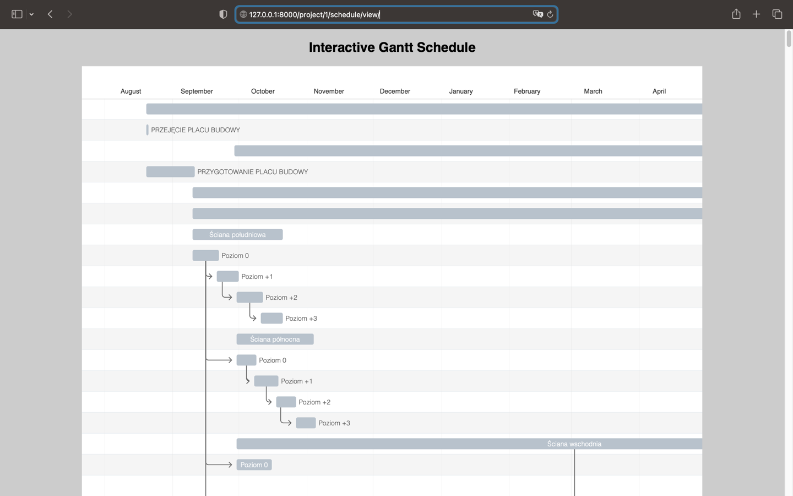

# WEB APPLICATION FOR MANAGEMENT BUILDING PROJECT

## Features

* Interface for creating users with email verification

* Login and Logout, access based on permissions

* Create Projects, add members to project, upload drawing documents

* Add comments for drawing, change drawing status, search for a drawing by special parameters

* GANTT schedule, uploading the schedule in CSV format from Microsoft Project

## Tech stack: 
* Python, 
* Django, 
* Django Recaptcha, 
* Pandas